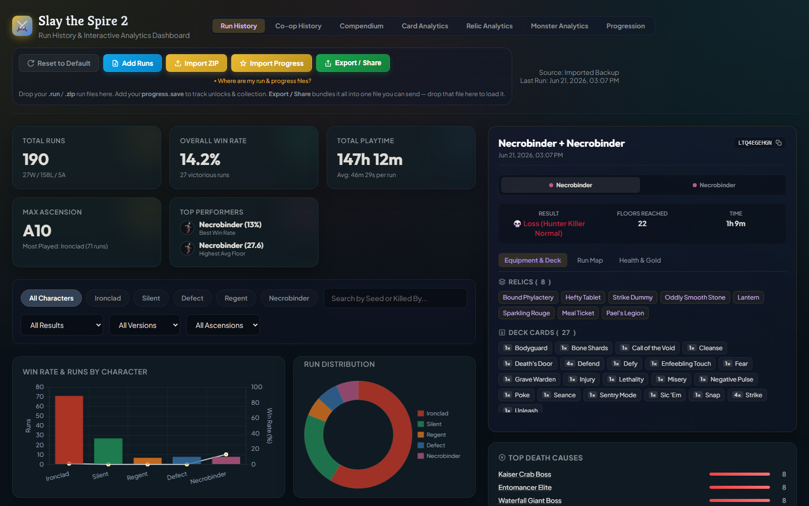
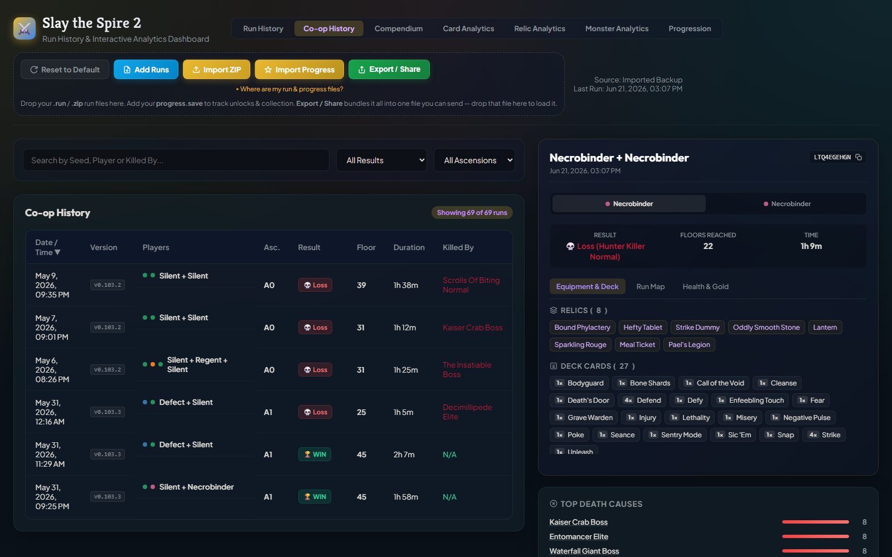
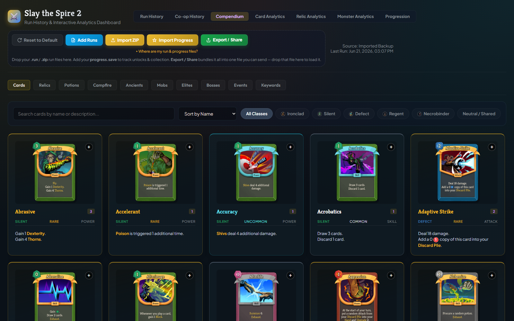
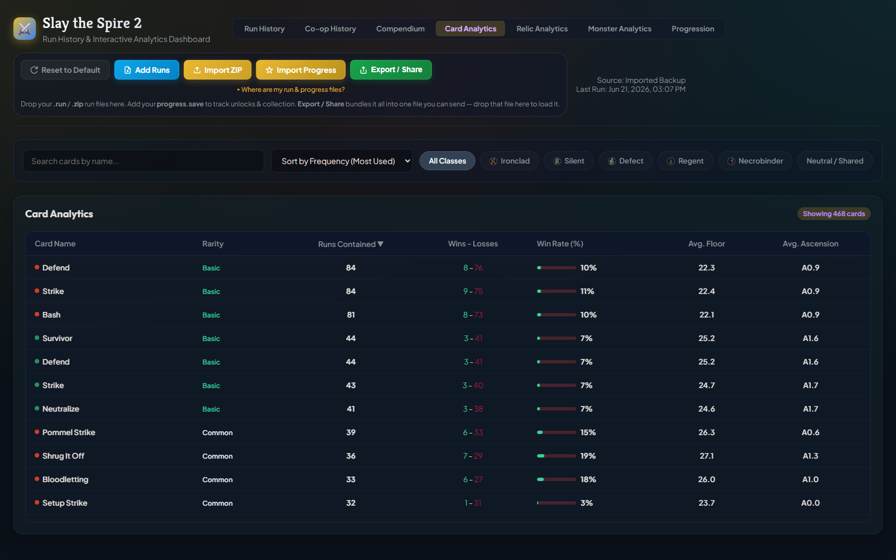
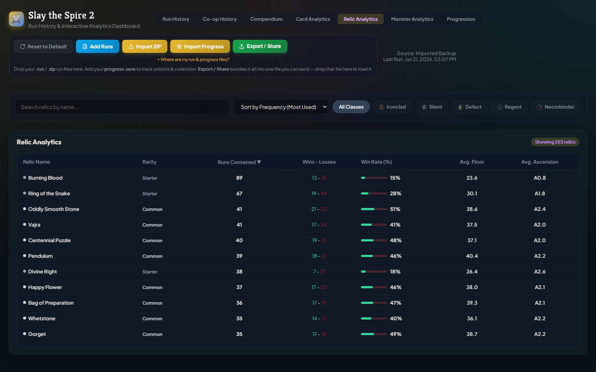
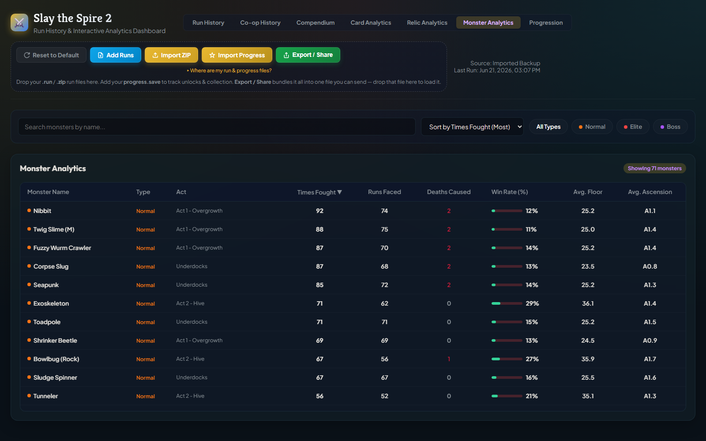
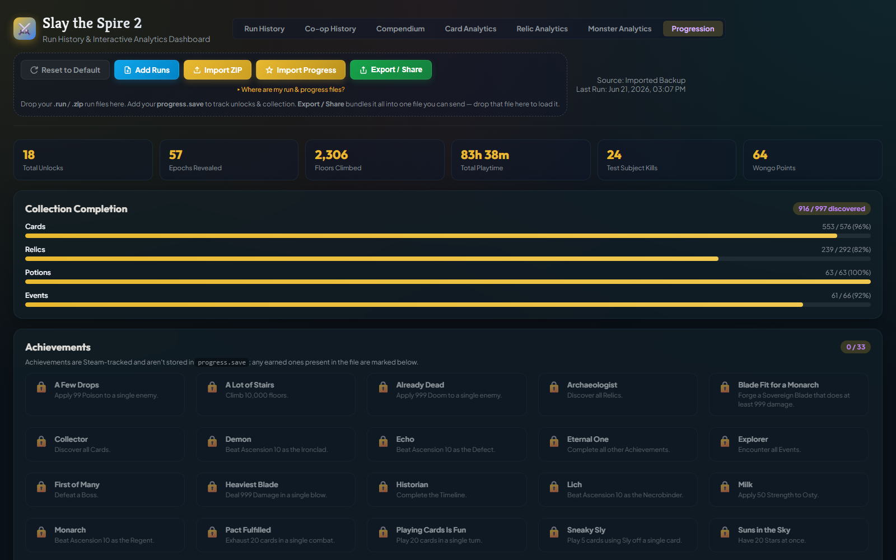

# Slay the Spire 2 Run History Dashboard

A privacy-first, browser-based run analytics dashboard and database compendium for **Slay the Spire 2**. Everything runs client-side — your runs are parsed in your browser and never leave your device — and the full game database is embedded in the page, so the compendium is populated the moment you open it.

This dashboard allows you to import, visualize, and analyze your runs (both Single Player and Co-op) directly from your game run files.



## Features

- **Run History**: Table views of all loaded single player and co-op runs with pagination, search, and sorting.
- **Run Map Timeline**: Detailed interactive step-by-step path visualizer for each run showing floors, events, combats, rest sites, shops, and boss nodes.
- **Card & Relic Analytics**: Win rates, pick rates, survival distributions, and playstyle correlation tables based on your uploaded history.
- **Survival & Playstyle Charts**: Floor-by-floor survival rates and radar charts depicting your playstyle (Aggressive, Defensive, Tactical, Wealthy).
- **Built-in Compendium**: A complete Slay the Spire 2 database of Cards, Relics, and Monsters with hover tooltips, rarity color-coding, and move-set/intent lists — embedded in the page, so it's populated without importing anything (the artwork itself loads from public CDNs).
- **Unlocks & Progression**: Import your `progress.save` to see a **Progression** tab (unlock timeline grouped by character, collection-completion bars, lifetime stats, and an achievements checklist) plus an **"Unlocked this run"** section on each run, correlated by timestamp.
- **Share / Export**: Bundle your imported runs + progression into a single `.json` file with the **Export / Share** button. Send it to anyone — they drop it onto their dashboard to view your snapshot (a banner reminds them they're viewing shared data and to load their own save).
- **Privacy First**: Your runs and progress are parsed locally and stored only in your browser's `localStorage` for quick access next time — none of your data is ever uploaded or sent to any server. (The page does fetch static assets — the charting library, web fonts, and entity art — from public CDNs, but those requests never carry your run data.)

> **Connectivity:** The dashboard runs entirely in your browser and the game database is embedded, but a few assets load from public CDNs — **Chart.js** (charts), **JSZip** (`.zip` imports), **Google Fonts**, and the card/relic/monster/character **artwork**. With no internet, your runs and stats still load and every analytic still computes, but charts won't render, `.zip` import is unavailable, fonts fall back to system defaults, and missing artwork is hidden (each image is guarded so nothing else breaks). Everything else works offline.

## Dashboard Tour

### Run History


Your home base. Headline KPIs (total runs, overall win rate, total playtime, max ascension, and your best-performing characters), a **Wins & Runs by Character** bar chart, a **Run Distribution** donut, and **Top Death Causes**. Pick any run to open a detail panel with its deck, relics, an interactive **Run Map** timeline, a floor-by-floor **Health & Gold** chart, and the unlocks earned during that run.

### Co-op History


The same breakdown for multiplayer runs. Each entry shows both players' characters, the shared result, floors reached, and what ended the run; the detail panel has a per-player selector so you can inspect each teammate's deck and relics.

### Compendium


A complete built-in database of **Cards, Relics, Potions, Mobs, Elites, Bosses, Events, Keywords, and Ancients** — with real game art, rarity color-coding, hover tooltips, an upgraded-card toggle, and click-to-zoom detail. The data is embedded in the page, so it's fully populated without importing anything; the artwork is pulled from public CDNs and degrades gracefully if you're offline.

### Card Analytics


How every card actually performs in *your* games: runs contained, win–loss record, win rate, and average floor/ascension. Filter by character class and sort by any column.

### Relic Analytics


The same performance view for relics, with co-op inventory awareness so each player's relics are counted correctly.

### Monster Analytics


Encounter stats for normal mobs, elites, and bosses: how often you've fought each, how many runs faced them, how many runs they **ended**, and the win rate of runs that encountered them. Filter by Normal / Elite / Boss.

### Progression


Built from your `progress.save`: lifetime stats (unlocks, epochs, floors climbed, playtime), **collection-completion** bars for cards/relics/potions/events, an **achievements** checklist, and an **unlock timeline** grouped by character showing exactly which cards and relics each milestone granted.

## Where to Find Your Run History Files

To import your runs into the dashboard, drag and drop the JSON files from your game's run history folder into the dashboard. You can find these files in the following locations:

### Windows
- **Steam Cloud Location (Recommended)**:
  `C:\Program Files (x86)\Steam\userdata\<YOUR_STEAM_ID>\2868840\remote\profile1\saves\history\`
- **Local AppData Location**:
  `%AppData%\SlayTheSpire2\steam\<YOUR_STEAM_ID>\profile1\saves\history\`

*(Note: Replace `<YOUR_STEAM_ID>` with your actual unique Steam numeric ID, and `profile1` with your corresponding in-game profile number if you use multiple profiles.)*

### Tracking Unlocks & Progression (optional)

To populate the **Progression** tab and per-run "Unlocked this run" sections, also import your **`progress.save`** file. It sits one level **above** the `history` folder (in the `saves` directory) — e.g. on Windows Steam Cloud:

`C:\Program Files (x86)\Steam\userdata\<YOUR_STEAM_ID>\2868840\remote\profile1\saves\progress.save`

Drag it onto the dashboard or use the **Import Progress** button. (Note: in-game achievements are tracked by Steam and are *not* stored in `progress.save`, so the achievements checklist shows progress only if the file happens to contain unlocked-achievement data.)

### Sharing Your Dashboard With Someone

Click **Export / Share** to download a single `sts2-dashboard-export-<date>.json` containing your runs and progression. Anyone can load it by dragging it onto their own dashboard (or onto the hosted GitHub Pages link). While viewing a shared snapshot, a banner reads *"Shared snapshot — you're viewing someone else's runs"* with a **Load my save** shortcut, so recipients always know what they're looking at. Imported runs merge with theirs (duplicates are skipped), and **Reset to Default** clears everything, including the shared snapshot.

### macOS
`~/Library/Application Support/Steam/userdata/<YOUR_STEAM_ID>/2868840/remote/profile1/saves/history/`

### Linux (Steam Deck / Proton)
`~/.steam/steam/userdata/<YOUR_STEAM_ID>/2868840/remote/profile1/saves/history/`

## Architecture

`sts2_dashboard.html` is **hand-maintained directly** — its CSS, JavaScript, and markup are edited in place. The game database is embedded inside it as a `const sts2Database = { ... }` block, fenced by `/* STS2_DATABASE_START */` … `/* STS2_DATABASE_END */` markers.

Game data and the dashboard's UI are therefore updated independently:

- **UI changes** (layout, styling, new features) → edit `sts2_dashboard.html` directly.
- **Game-data changes** → run `compile_db.ps1` then `embed_database.ps1`, which swaps *only* the marked database block and leaves everything else untouched.

> **Do not run `generate_dashboard.ps1`.** It is deprecated and disabled (it throws on start). It was the original full-HTML generator, but the dashboard has since diverged from it; running it would overwrite all current UI work. It is retained only as a reference for the run-parsing logic.

## Files in this Repository

- `sts2_dashboard.html`: The ready-to-use dashboard, hand-maintained. Open in any modern web browser. (The game database is embedded; the charting library, ZIP-import helper, web fonts, and entity art load from public CDNs — see **Connectivity** above.)
- `compile_db.ps1`: Database compiler — pulls raw game data from the Spire Codex API and builds `sts2_database.json`.
- `embed_database.ps1`: Injects `sts2_database.json` into the dashboard's embedded database block (between the `STS2_DATABASE` markers), without regenerating the rest of the HTML.
- `sts2_database.json`: The compiled database of cards, relics, potions, monsters, events, keywords, epochs (unlocks), and achievements used by the dashboard.
- `cards_api.json`, `relics_api.json`, `monsters_api.json`, `encounters_api.json`, `events_api.json`, `potions_api.json`, `keywords_api.json`, `epochs_api.json`, `achievements_api.json`: Source API data caches.
- `validate_js.js`: Helper that verifies the syntax of every `<script>` block in `sts2_dashboard.html`. Run `node validate_js.js` after editing the dashboard's JS.
- `generate_dashboard.ps1`: **Deprecated / disabled.** Original full-HTML generator, kept for reference only.

## How to Update the Game Data

When the game gets a balance patch or new content, refresh the embedded database:

```powershell
.\compile_db.ps1       # rebuild sts2_database.json from the API caches
.\embed_database.ps1   # swap the new database into sts2_dashboard.html
```

Only the embedded database block changes; the dashboard UI is preserved. (The GitHub Action below does this automatically.)

## Auto-Update (GitHub Actions)

This repository includes a GitHub Actions workflow that **automatically checks for game updates daily** and rebuilds the dashboard if new data is found.

### How it works

1. Every day at 06:00 UTC, the workflow downloads the latest card, relic, monster, encounter, event, potion, and keyword data from the [Spire Codex](https://github.com/ptrlrd/spire-codex) repository.
2. It compares the downloaded data against the committed API JSON files.
3. If any changes are detected, it rebuilds the compiled database (`compile_db.ps1` → `sts2_database.json`) and embeds it into the dashboard's database block (`embed_database.ps1` → `sts2_dashboard.html`). The dashboard UI is left untouched.
4. The updated data files and dashboard are automatically committed and pushed back to the repository.

If no changes are detected, the workflow exits cleanly with no commit.

### Manual trigger

You can also trigger an update manually at any time:

1. Go to the **Actions** tab on the GitHub repository page.
2. Select the **Auto-Update Game Database** workflow.
3. Click **Run workflow** → **Run workflow**.
